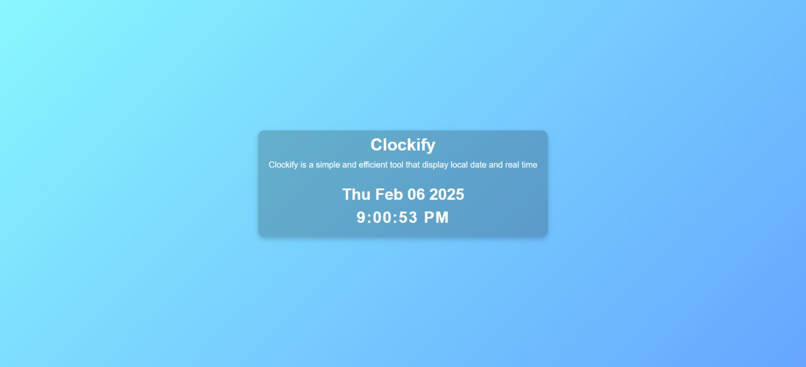

# Clockify

Clockify is a simple web application that helps users view their local date and real time. The application updates every second to show the accurate current time and date.

## 🕰️ Demo Screenshot



## 🔗 Live Demo

- Check out the app live here: **[Clockify](https://premkrrajbhar.github.io/Clockify/)**

## 🌟 Features

- **Real-time Clock**: Displays the current time with accuracy, updated every second.
- **Current Date**: Shows the date in a user-friendly format.
- **Dynamic Updates**: Time and date automatically refresh every second.

## 🛠️ Technologies Used

- **HTML**: Provides the structure and layout of the web page.
- **CSS**: Styles the app with a clean, modern design to ensure a responsive experience.
- **JavaScript**: Dynamically shows the current date and time, updating the page every second.

## 💻 How to Use

- **View Date and Time**: The current date and time are automatically displayed when you visit the page.
- **Live Updates**: The time updates every second, ensuring that the clock is always accurate.

## 📂 Project Structure

```
├── README.md
├── assets/
│   ├── favicon/
│   │   └── clock-favicon.png
│   └── screenshot/
│       └── screenshot.jpg
├── css/
│   └── style.css
├── index.html
└── script/
    └── script.js

```

## 📥 How to Run Locally

- Step 1: Clone the repository:

```bash
   git clone https://github.com/premkrrajbhar/Clockify.git
```

- Step 2: Navigate to the project folder:

```bash
   cd Clockify
```

- Step 3: Open the `index.html` file in your web browser to start using the app.

## 🤝 Contributing

Contributions are welcome! If you have suggestions or improvements, feel free to submit a pull request or open an issue.

## 📞 Contact

For any questions or feedback, please reach out to:

- **Email**: [premkumar224487@gmail.com](mailto:premkumar224487@gmail.com)
- **GitHub**: [premkrrajbhar](https://github.com/premkrrajbhar)
